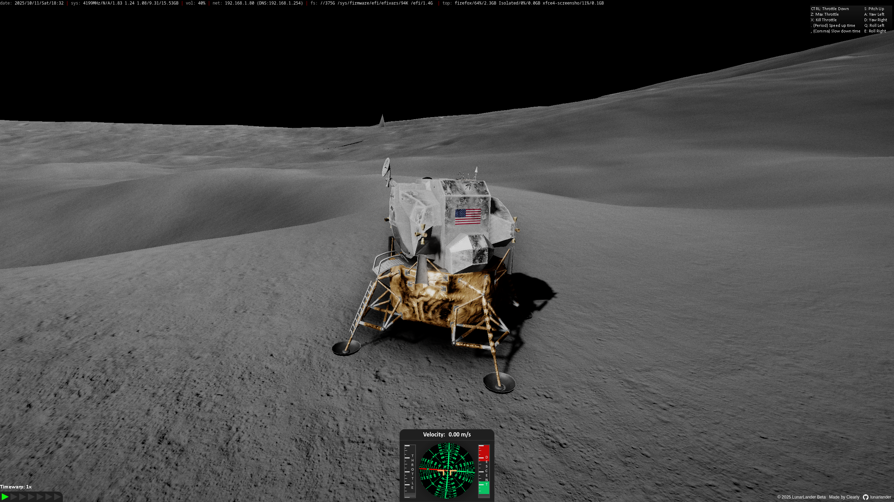
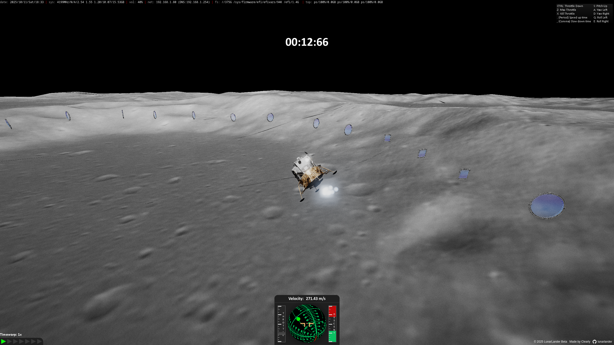

<p align="center">
  
</p>

[LunarLander.io](https://lunarlander.io) is a online browser-based lunar flight simulator that puts you in the cockpit of the Apollo 11 lunar module on a 1/4th scale version of our moon. Players navigate challenging obstacle courses while experiencing realistic Newtonian physics, and can experiment with the Moon's gravity and the spacecraft's thrust.

You can try it live at [LunarLander.io](https://lunarlander.io) or run it locally.

[]()
[](https://github.com/clearlyyy/lunarlander/releases)


# 🌕 Features
* **Real time lunar flight simulation**
* **Timed Obstacle courses**
* **Newtonian Physics**: Park yourself into orbit!
* **Cross-platform**: Play in any modern web browser with WebGL Support

  

# 🌙 Installation and Setup
Start by installng Git and NPM

Use the following command to clone the repo

```bash 
git clone https://github.com/clearlyyy/lunarlander.git
```
Enter the ```lunarlander``` directory
```bash
cd lunarlander
```
Now install all of the dependencies
```bash
npm install
```
# ☄️ Development
To start the game locally, you'll need a Cesium API Token, which can be obtained [here](https://ion.cesium.com/tokens) . (This requires a Cesium Ion Account, its free)

Now you need to create a ```.env``` file in the root directory of the project.
Then put your asset token in it, like so.
```bash
VITE_ACCESS_TOKEN=your_access_token
```

Now your ready to go. To start the development server, run this command
```bash
npm run dev
```

# Contributing
If you'd like to contribute i'd be happy to look at PRs, just be reasonable. Thanks.


